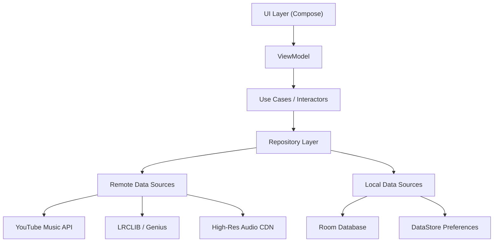
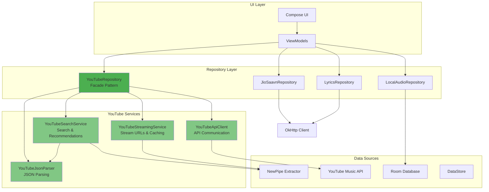

# SuvMusic – Advanced Audio Streaming Engineer for Android

<div align="center">

[](https://github.com/suvojeet-sengupta/SuvMusic/graphs/commit-activity)
[](https://kotlinlang.org)
[](https://developer.android.com)
[](LICENSE)
[](https://github.com/suvojeet-sengupta)

</div>

**SuvMusic** is a high-performance, open-source music streaming application engineered for audiophiles and power users. It leverages a modern, clean architecture to deliver a seamless fusion of YouTube Music's vast catalog and high-fidelity audio streams (up to 320kbps), completely bypassing traditional API limitations and ad networks.

Architected by **[Suvojeet Sengupta](https://github.com/suvojeet-sengupta)**, this project serves as a comprehensive reference implementation for modern Android engineering, featuring Jetpack Compose, Hilt, Coroutines, and Media3.

---

## 🏗 Architectural Overview

The application follows a strictly typed **MVVM (Model-View-ViewModel)** pattern with **Clean Architecture** principles, ensuring separation of concerns, testability, and scalability.



### Key Engineering Decisions

*   **Single Activity Architecture**: Utilizes a single `MainActivity` with `Compose Navigation` for seamless screen transitions and efficient state management.
*   **Reactive Data Flow**: Extensive use of `Kotlin Flow` and `StateFlow` ensures UI states are completely reactive to underlying data changes (downloads, playback state, network connectivity).
*   **Dependency Injection**: `Hilt` is employed for compile-time dependency injection, managing singleton scopes for repositories and service bindings transparently.
*   **Offline-First Capability**: `Room` database acts as the single source of truth for library data, with repository logic handling synchronization with remote sources.

---

## 🚀 Core Features & capabilities

### 1. Hybrid Audio Engine
Unlike standard wrappers, SuvMusic implements a custom audio resolution strategy:
*   **Dual-Source Resolution**: Dynamically resolves audio streams from multiple providers (`YouTube`, `JioSaavn`) to guarantee the highest bitrate (320kbps AAC/OPUS) availability.
*   **Smart Buffering**: Implements custom `LoadControl` in `ExoPlayer` to optimize buffer sizes based on network type, minimizing latency while ensuring gapless playback.
*   **Loudness Normalization**: (In Development) volume normalization DSP to ensure consistent listening levels across different tracks.

### 2. Advanced Lyric Synchronization System
A sophisticated lyrics aggregation pipeline designed for precision:
*   **Priority Queue Parsing**:
    1.  **LRCLIB API**: Fetches community-verified time-synced LRC data.
    2.  **Embedded Lyrics**: Extracts ID3v2 SYLT frames from local media.
    3.  **Fallback Scrapers**: Parses static lyrics from provider metadata if synchronization fails.
*   **Real-time Interpolation**: The UI uses a linear interpolation algorithm to render smooth lyric scrolling synchronized to the millisecond with the active media player position.

### 3. "Dynamic Island" Overlay Service
A technical demonstration of Android's `SYSTEM_ALERT_WINDOW` capabilities:
*   **Foreground Service**, decoupling the overlay UI from the main application lifecycle.
*   **Gesture Dispatching**: Custom touch event handling to allow the overlay to expand/collapse without interfering with underlying applications.
*   **State Synchronization**: Binds directly to the central `MediaSessionService` to reflect real-time playback updates with zero polling.

### 4. Custom Video/Audio Search Algorithm
Enhances discovery by merging distinct data pipelines:
*   **Parallel execution** of `Structured Search` (Official Tracks) and `Unstructured Search` (Community Uploads/Videos) using `async/await` patterns.
*   **Deduplication Logic**: Custom comparison algorithms filter out identical tracks across different sources to present a unified result list.

---

## 🛠 Technology Stack

### Language & Runtime
*   **Kotlin 2.0+**: Leveraging K2 compiler improvements with strict null safety
*   **Coroutines**: For managing background threads and strict structured concurrency
*   **Kotlin Flow**: Reactive streams for asynchronous data handling

### User Interface
*   **Jetpack Compose**: 100% declarative UI with Material 3
*   **Material 3**: Latest Material Design guidelines implementation
*   **Coil 3.x**: Memory-efficient image loading with hardware-backed bitmap pooling
*   **Compose Navigation**: Type-safe navigation between screens
*   **Compose Animation**: Smooth transitions and animations

### Architecture & Dependency Injection
*   **Hilt**: Compile-time dependency injection built on Dagger
*   **Hilt Navigation Compose**: ViewModel injection for Compose
*   **MVVM Pattern**: Model-View-ViewModel with Clean Architecture
*   **Repository Pattern**: Abstraction layer for data sources

### Media & Playback
*   **Media3 (ExoPlayer 1.5+)**: Industry-standard media playback engine
  - `media3-exoplayer`: Core playback functionality
  - `media3-session`: MediaSession for background playback
  - `media3-ui`: Player UI components
  - `media3-common`: Common utilities
*   **MediaRouter**: Casting and external display support

### Data & Network
*   **OkHttp 4.x**: High-performance HTTP client
  - Custom interceptors for header manipulation
  - Connection pooling and caching
  - Logging interceptor for debugging
*   **NewPipe Extractor**: YouTube parsing without API keys
*   **Retrofit** (Implicit via OkHttp): Type-safe HTTP client
*   **Gson**: JSON serialization/deserialization
*   **Jsoup**: HTML parsing for web scraping

### Local Data & Persistence
*   **Room 2.6+**: Abstraction layer over SQLite
  - Type-safe database access
  - Compile-time query verification
  - Flow-based reactive queries
*   **DataStore Preferences**: Type-safe key-value storage
*   **Security Crypto**: Encrypted SharedPreferences
*   **Core Library Desugaring**: Java 8+ API support on older Android

### Testing
*   **JUnit**: Unit testing framework
*   **Espresso**: UI testing
*   **Compose UI Testing**: Compose-specific UI tests

---

## 📦 Complete Dependency Map

### Core Dependencies

| Dependency | Version | Purpose |
|-----------|---------|---------|
| `androidx.core:core-ktx` | Latest | Kotlin extensions for Android framework |
| `androidx.lifecycle:lifecycle-runtime-ktx` | Latest | Lifecycle-aware components |
| `androidx.lifecycle:lifecycle-viewmodel-compose` | Latest | ViewModel integration with Compose |
| `androidx.lifecycle:lifecycle-runtime-compose` | Latest | Lifecycle utilities for Compose |

### UI Dependencies

| Dependency | Version | Purpose |
|-----------|---------|---------|
| `androidx.compose.ui:ui` | Latest (BOM) | Core Compose UI |
| `androidx.compose.material3:material3` | Latest | Material 3 components |
| `androidx.compose.ui:ui-tooling-preview` | Latest | Compose preview support |
| `androidx.compose.material:material-icons-extended` | Latest | Extended Material icons |
| `androidx.compose.animation:animation` | Latest | Animation APIs |
| `androidx.navigation:navigation-compose` | Latest | Compose navigation |
| `io.coil-kt:coil-compose` | Latest | Image loading library |

### Media Dependencies

| Dependency | Version | Purpose |
|-----------|---------|---------|
| `androidx.media3:media3-exoplayer` | 1.5+ | Media playback engine |
| `androidx.media3:media3-session` | 1.5+ | Background playback support |
| `androidx.media3:media3-ui` | 1.5+ | Player UI components |
| `androidx.media3:media3-common` | 1.5+ | Common media utilities |
| `androidx.mediarouter:mediarouter` | Latest | Casting support |

### Networking Dependencies

| Dependency | Version | Purpose |
|-----------|---------|---------|
| `com.squareup.okhttp3:okhttp` | 4.x | HTTP client |
| `com.squareup.okhttp3:logging-interceptor` | 4.x | Network logging |
| `com.github.TeamNewPipe:NewPipeExtractor` | Latest | YouTube API extraction |
| `org.jsoup:jsoup` | Latest | HTML parsing |
| `com.google.code.gson:gson` | Latest | JSON processing |

### Dependency Injection

| Dependency | Version | Purpose |
|-----------|---------|---------|
| `com.google.dagger:hilt-android` | Latest | DI framework |
| `com.google.dagger:hilt-compiler` | Latest | Hilt annotation processor |
| `androidx.hilt:hilt-navigation-compose` | Latest | Hilt + Compose Navigation |

### Data Storage

| Dependency | Version | Purpose |
|-----------|---------|---------|
| `androidx.room:room-runtime` | 2.6+ | Database runtime |
| `androidx.room:room-ktx` | 2.6+ | Kotlin extensions for Room |
| `androidx.room:room-compiler` | 2.6+ | Room annotation processor |
| `androidx.datastore:datastore-preferences` | Latest | Key-value storage |
| `androidx.security:security-crypto` | Latest | Encrypted storage |

### Build & Tooling

| Dependency | Version | Purpose |
|-----------|---------|---------|
| `com.android.tools:desugar_jdk_libs_nio` | 2.0.4 | Java 8+ API support (minSdk 26) |
| `com.google.devtools.ksp` | Latest | Kotlin Symbol Processing |

---

## 🏗 Refactored Architecture

The application follows **Clean Architecture** with a modular **MVVM** pattern. The recent refactoring extracted YouTube-related logic into specialized services:



### Repository Layer Structure

```
data/repository/
├── YouTubeRepository.kt          (1,873 lines - Main facade)
├── JioSaavnRepository.kt         (Music streaming from JioSaavn)
├── LocalAudioRepository.kt       (Local audio file scanning)
├── LyricsRepository.kt           (Lyrics from multiple sources)
├── ListeningHistoryRepository.kt (Playback history tracking)
└── youtube/
    ├── internal/
    │   ├── YouTubeJsonParser.kt  (291 lines - JSON utilities)
    │   └── YouTubeApiClient.kt   (237 lines - API communication)
    ├── streaming/
    │   └── YouTubeStreamingService.kt (190 lines - Stream handling)
    └── search/
        └── YouTubeSearchService.kt (310 lines - Search functionality)
```

### Key Architectural Decisions

*   **Single Activity Architecture**: One `MainActivity` with Compose Navigation
*   **Reactive Data Flow**: `StateFlow` and `Flow` for reactive UI updates
*   **Dependency Injection**: Hilt manages all singletons and scoped instances
*   **Offline-First**: Room as single source of truth with network sync
*   **Service Extraction**: YouTube logic split into 4 specialized services (30% code reduction)
*   **Facade Pattern**: YouTubeRepository acts as a simple facade delegating to services

---

## ⚡ Performance Optimizations

*   **Baseline Profiles**: Included to improve application startup time and reduce frame jank by pre-compiling critical code paths.
*   **R8 Full Mode**: Aggressive shrinking and obfuscation to minimize APK size (~50MB) and optimize bytecode.
*   **Memory Leak Detection**: Developed with strict adherence to lifecycle observation to prevent context leaks, verified via LeakCanary during debug builds.

---

## 👨‍💻 About the Developer

**Suvojeet Sengupta**  
*Senior Android Engineer & Open Source Enthusiast*

Based in **India 🇮🇳**, I specialize in building scalable, performance-critical mobile applications. SuvMusic represents my philosophy that software should be beautiful, respectful of the user, and technically uncompromising.

[GitHub](https://github.com/suvojeet-sengupta) • [LinkedIn](#) • [Portfolio](#)

---

## 📜 License

This project is licensed under the MIT License - see the [LICENSE](LICENSE) file for details.


## ⚠️ DMCA / Copyright Disclaimer

This application is developed specifically for educational and research purposes. It organizes and presents content available from third-party services (YouTube Music, JioSaavn) in a unified interface.

**To Copyright Holders (YouTube, Google, JioSaavn, and Record Labels):**
If you identify any content within this application that violates your copyright or terms of service, **please contact the developer directly before initiating any legal action or DMCA takedowns.**

We respect intellectual property rights and are committed to resolving any valid concerns amicably and promptly, including removing specific content or features if necessary.

*Disclaimer: This application is for educational and research purposes only. It interacts with third-party services and users must verify their compliance with relevant terms of service.*
